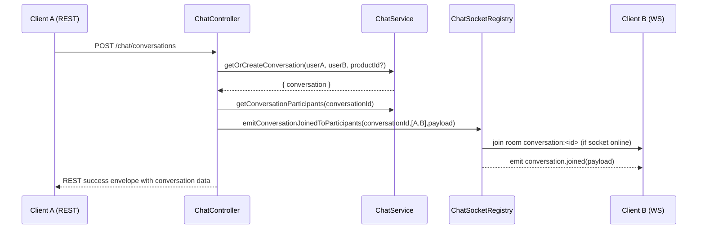
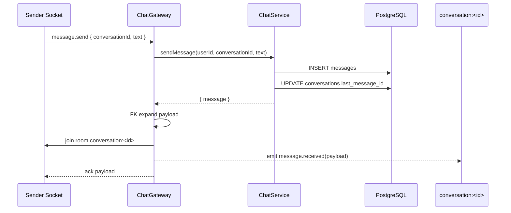
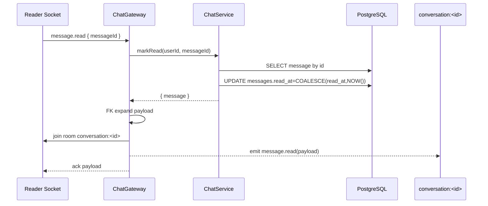

# Chat Module Deep-Dive Review

## 1. Summary

This document explains how the chat subsystem works end-to-end in runtime code, including REST, WebSocket, persistence, security checks, broadcasting behavior, and observability.

Primary sources reviewed:
- `src/chat/chat.module.ts`
- `src/chat/chat.controller.ts`
- `src/chat/chat.gateway.ts`
- `src/chat/chat.service.ts`
- `src/chat/chat-socket-registry.service.ts`
- `src/chat/chat-ws-exception.filter.ts`
- `src/chat/redis-io.adapter.ts`
- `db/migrations/0003_conversations_last_message.sql`
- `db/migrations/0010_favorites_blocks_chat_product_context.sql`
- global response/expansion interceptors in `src/common/interceptors/*`
- chat specs in `src/chat/*.spec.ts`

This is an architecture and behavior review only. No runtime code was changed.

## 2. Architecture Map

### 2.1 Composition (`ChatModule`)

`ChatModule` wires the chat feature with:
- `ChatController` for authenticated REST endpoints (`/chat/*`)
- `ChatGateway` for Socket.io namespace `/chat`
- `ChatService` as domain/service layer for validation + DB operations
- `ChatSocketRegistryService` for tracking connected sockets by `userId`
- `ChatWsExceptionFilter` for structured WS error envelopes
- `AppLogger` and `FkExpansionService` as shared cross-cutting services

It imports:
- `JwtModule` (WS auth token verification)
- `DatabaseModule`
- `FilesModule` (used by FK expansion of related file entities)

### 2.2 Responsibility boundaries

- `ChatController`: HTTP route orchestration + invoking service + REST-triggered WS join broadcast.
- `ChatGateway`: WS auth/session binding, event handlers, room joins, room emits, WS lifecycle logging.
- `ChatService`: authoritative business rules and SQL interaction.
- `ChatSocketRegistryService`: in-memory user->socket registry and participant join emission helper.
- `ChatWsExceptionFilter`: normalizes WS exceptions to stable client-facing `chat.error` schema and logs failures.
- `RedisIoAdapter`: optional Socket.io Redis adapter for multi-instance scaling.

## 3. Data Model and Persistence Flow

## 3.1 Key tables and fields

- `conversations`
  - participants: `user_a_id`, `user_b_id`
  - optional context: `product_id` (nullable)
  - denormalized pointer: `last_message_id` (nullable)
  - `created_at`
- `messages`
  - `conversation_id`, `sender_id`, `message_text`, `sent_at`, `read_at`
- `user_blocks`
  - `blocker_id`, `blocked_id`

### 3.2 Migration intent

- `0003_conversations_last_message.sql`
  - Adds `conversations.last_message_id` and backfills it from latest message by `sent_at`.
  - Purpose: avoid expensive lateral/latest-message lookup each time conversation list is fetched.

- `0010_favorites_blocks_chat_product_context.sql`
  - Adds optional `conversations.product_id` + index.
  - Adds `user_blocks` table (hard user block relationship).
  - Introduces chat context + block capability used directly by `ChatService` guardrails.

### 3.3 Write path highlights

- `sendMessage` inserts a row in `messages`, then updates `conversations.last_message_id` to the new message id.
- `markRead` sets `read_at = COALESCE(read_at, NOW())` (idempotent on repeated reads).
- `getOrCreateConversation` may backfill missing `conversation.product_id` if provided in a later create call.

## 4. REST Surface and Runtime Flow

All REST routes in `ChatController` are behind `JwtAuthGuard`.

Global HTTP behaviors (from `main.ts`):
- Validation pipe with transform/whitelist/non-whitelisted rejection.
- `FkExpansionInterceptor` expands FK scalar fields to embedded objects.
- `HttpResponseEnvelopeInterceptor` wraps success payloads into:

```json
{ "success": true, "statusCode": <http_code>, "data": ... }
```

Flattening rule: if service/controller returns exactly one top-level key (for example `{ conversations: [...] }`), `data` is flattened to that value.

### 4.1 `POST /chat/conversations`

Controller method: `createConversation`.

Input:
- `participantId` (required, >0)
- `productId` (optional, >0)

Service flow (`getOrCreateConversation`):
1. Reject self-conversation (`userId === participantId`) -> `400`.
2. Ensure participant exists (`assertUserExists`) -> `404` if not.
3. Reject if either direction exists in `user_blocks` -> `403` with reason `CONVERSATION_BLOCKED`.
4. Normalize participant ordering into `(user_a_id, user_b_id)`.
5. If `productId` provided:
   - ensure product exists and not deleted
   - if product not `available`, only participants that include owner may proceed
6. If conversation already exists:
   - optionally set `product_id` when conversation had null and input has product
   - return hydrated conversation
7. Else insert new conversation and return hydrated conversation.

Post-service controller behavior:
- Extract returned `conversation.id`.
- Fetch exact participants using `getConversationParticipants`.
- Build payload `{ success, conversationId, room, joinedAt, conversation }`.
- Invoke `chatSocketRegistry.emitConversationJoinedToParticipants(...)`.

Effect: REST conversation creation/get can proactively join active sockets of both participants to the room and emit `conversation.joined`, even before either client sends `conversation.join` over WS.

### 4.2 `GET /chat/conversations`

Controller delegates to `listConversations(userId, scope, limit, offset)`.

Runtime scope:
- `all`
- `buy`
- `sell`

SQL characteristics:
- selects conversation metadata + denormalized last message via `last_message_id`
- computes `peer_user_id`
- joins optional product and first product image
- computes unread count as count of messages in conversation where sender != current user and `read_at IS NULL`
- filters out blocked relationships through `NOT EXISTS` against `user_blocks`
- scope filter:
  - `buy`: conversation has product and current user is not owner
  - `sell`: conversation has product and current user is owner
- ordered by latest activity: `COALESCE(last_message.sent_at, conversation.created_at) DESC`

### 4.3 `GET /chat/conversations/:id`

Controller delegates to `getConversationById(userId, conversationId)`.

Service flow:
1. `assertConversationParticipant` (existence + participant membership + block check)
2. fetch same metadata shape as list query for one row
3. throw `404` if not found

### 4.4 `GET /chat/conversations/:id/messages`

Controller delegates to `listMessages(userId, conversationId, limit, before)`.

Service flow:
1. `assertConversationParticipant`
2. fetch messages by `conversation_id`, optional cursor `sent_at < before`
3. sort descending by `sent_at`, limit bounded by DTO

Notes:
- Cursor is timestamp-based (`before` ISO string), not message-id based.
- Returned order is newest-first.

## 5. WebSocket Surface (`/chat`) and Runtime Flow

Gateway: `@WebSocketGateway({ namespace: '/chat' })`.
Validation:
- strict DTO validation using `ValidationPipe`
- implicit conversion enabled
- rejects unknown fields
- validation errors become `WsException` with code `VALIDATION_ERROR`

Error handling:
- class-level `@UseFilters(ChatWsExceptionFilter)`

### 5.1 Connection/auth handshake

`handleConnection(client)`:
1. Extract token from either:
   - `handshake.auth.token`
   - `Authorization` header
2. Verify JWT with `app.jwtAccessSecret`.
3. Normalize `sub` to positive integer.
4. Store normalized user into `client.data.user`.
5. Register socket with `ChatSocketRegistryService.registerUserSocket(userId, socket)`.
6. Log successful connection.

Failure path:
- log auth failure and `client.disconnect(true)`.

Disconnect:
- unregister user socket from registry.
- log disconnect.

### 5.2 `conversation.join`

Handler flow:
1. Get authenticated socket user from `client.data.user` or throw `UnauthorizedException`.
2. Log inbound event.
3. `chatService.assertConversationParticipant(conversationId, user.sub)`.
4. Fetch hydrated conversation via `getConversationById`.
5. Join room `conversation:<id>`.
6. Broadcast to room: `conversation.joined` with payload:
   - `success`, `conversationId`, `room`, `joinedAt`, `conversation`
7. Log emit and success lifecycle.
8. Return ack `{ success: true, room }`.

Important behavior:
- Event is room-wide, including sender socket.

### 5.3 `message.send`

Handler flow:
1. authenticate socket user
2. log inbound event
3. call `chatService.sendMessage(userId, conversationId, text)`
4. expand FK relations with `FkExpansionService.expand({ success: true, ...response })`
5. ensure client joined to room `conversation:<id>`
6. broadcast `message.received` to room with expanded payload
7. log emit + success
8. return same payload as ack

### 5.4 `message.read`

Handler flow:
1. authenticate socket user
2. log inbound event
3. call `chatService.markRead(userId, messageId)`
4. expand FK relations
5. derive `conversation_id` from returned message
6. ensure client joined to room
7. broadcast `message.read` to room
8. log emit + success
9. return payload as ack

## 5.5 Sequence diagrams

### REST conversation bootstrap + auto-join emit



### WS `message.send` lifecycle



### WS `message.read` lifecycle



## 6. Guardrails and Enforcement

### 6.1 Participant and existence checks

`assertConversationParticipant(conversationId, userId)` is central:
- `404` if conversation missing
- `403 NOT_PARTICIPANT` if caller is not user A/B
- `403 CONVERSATION_BLOCKED` if block relationship exists between participants

This guard is reused by:
- get conversation
- list messages
- send message
- mark read
- WS join/send/read handlers via service methods

### 6.2 Block model

`hasBlockBetweenUsers(a,b)` checks both directions in `user_blocks`.
Consequences:
- cannot create conversation if blocked
- existing conversation becomes unusable once either side blocks the other
- blocked conversations are omitted from list endpoint query

### 6.3 Product-context guard

When creating conversation with `productId`:
- product must exist and not be deleted
- if product status != `available`, only owner-side participants are allowed

### 6.4 Read semantics

`markRead` enforces:
- message must exist
- caller must be participant
- sender cannot mark own message read (`403`)
- repeated reads keep original timestamp (`COALESCE` idempotence)

## 7. Error Model (WebSocket)

`ChatWsExceptionFilter` emits two events on errors:

1. `chat.error` (primary structured contract)
2. `exception` (secondary compatibility/debug payload)

`chat.error` shape:

```json
{
  "success": false,
  "error": {
    "code": "VALIDATION_ERROR|UNAUTHORIZED|FORBIDDEN|NOT_FOUND|INTERNAL_ERROR",
    "event": "<incoming event>",
    "message": "...",
    "details": [],
    "reason": "NOT_PARTICIPANT|CONVERSATION_BLOCKED",
    "context": {},
    "correlationId": "...",
    "timestamp": "..."
  }
}
```

Mapping summary:
- `WsException` -> typically `VALIDATION_ERROR` or `INTERNAL_ERROR`
- `BadRequestException` -> `VALIDATION_ERROR`
- `UnauthorizedException` -> `UNAUTHORIZED`
- `ForbiddenException` -> `FORBIDDEN` (+ optional reason/context)
- `NotFoundException` -> `NOT_FOUND`
- unknown -> `INTERNAL_ERROR` (no internal leak)

Safe context exposure:
- currently restricted to `message.send` + `FORBIDDEN`, exposing only safe `conversationId` if present.

## 8. Logging and Observability

### 8.1 Event lifecycle logging

`ChatGateway` logs per WS event stage:
- inbound received
- outbound emit sent
- inbound succeeded

Failure logging is centralized in `ChatWsExceptionFilter`.

Logged metadata includes:
- `service=chat-ws`, `protocol=ws`, `routeOrEvent`
- correlation/request id
- user id when known
- socket id, namespace, room
- optional payload (gated)
- payload shape
- status code and duration on success/failure

### 8.2 Correlation ID behavior

- Gateway prefers `x-request-id` from handshake header, fallback to socket id/random UUID depending on path.
- Exception filter also derives correlation id from handshake header, else random UUID.

### 8.3 Payload logging control

`app.logWsPayload` controls whether raw/sanitized payload content is included in logs.
Payload shape metadata is logged regardless.

## 9. Scaling Behavior

### 9.1 Local process behavior

`ChatSocketRegistryService` stores `Map<userId, Set<Socket>>`.
- supports multi-device sessions per user.
- REST-triggered join emits iterate all sockets for both participants.

### 9.2 Multi-instance behavior

`RedisIoAdapter` can attach Socket.io Redis adapter when `redisUrl` is configured.
- Enables inter-instance room/event propagation for WS emits.
- Important caveat: `ChatSocketRegistryService` state itself is in-memory per instance.
  - The REST-side `emitConversationJoinedToParticipants` only knows sockets connected to the current process.
  - In clustered deployments, proactive participant room-join from REST may be partial unless both users are connected to the same instance.
  - WS clients can still self-heal by emitting `conversation.join` from their own connected instance.

## 10. Test-backed Guarantees

## 10.1 What is explicitly covered

`chat.service.spec.ts` validates:
- participant existence check on conversation create
- FK violation mapping to `NotFoundException` on send
- timestamp normalization
- forbidden reasons and context for:
  - non-participant
  - blocked conversation

`chat.gateway.spec.ts` validates:
- WS connection success/failure behavior
- room join + `conversation.joined` emit
- `message.send` and `message.read` lifecycle patterns
- validation behavior with implicit conversion and structured validation failures

`chat.controller.spec.ts` validates:
- REST create conversation triggers registry emit to both participants

`chat-socket-registry.service.spec.ts` validates:
- participant sockets are joined and `conversation.joined` emitted

`chat-ws-exception.filter.spec.ts` validates:
- mapping of validation/unauthorized/forbidden/not-found/internal
- forbidden safe context projection + logging metadata fields

## 10.2 Coverage gaps and risks

1. Race on `last_message_id` ordering:
- `sendMessage` does two statements (insert then update).
- High concurrency may still be okay because each send updates to latest operation, but there is no transactional assertion around strict chronological winner by `sent_at`.

2. Conversation uniqueness enforcement is not shown in reviewed migrations:
- service assumes one conversation row per unordered pair (`user_a_id`, `user_b_id`) and uses first match.
- if DB unique constraint is absent elsewhere, duplicate rows are possible under race.

3. Clustered proactive auto-join limitations:
- registry is local memory; REST-triggered auto-join may not reach sockets connected on other app nodes.

4. `listMessages` cursor granularity:
- cursor uses `sent_at < before`; messages sharing identical timestamp at boundary can be skipped/duplicated depending on client paging strategy.

5. REST and WS response-shape divergence:
- REST payloads are globally enveloped/expanded by interceptors.
- WS payloads are manually expanded and emitted without HTTP envelope interceptor semantics.
- clients must not assume identical wrappers between transport types.

## 11. Practical Client Flow (Recommended)

1. Ensure access token is available.
2. Connect Socket.io namespace `/chat` with token in `auth.token` (or `Authorization` header).
3. Create/get conversation via `POST /chat/conversations` (optionally with `productId`).
4. Immediately fetch list via `GET /chat/conversations?scope=all|buy|sell` for tab state.
5. Load history with `GET /chat/conversations/:id/messages?limit=20`.
6. Emit `conversation.join` as explicit room-join fallback, even if REST auto-join exists.
7. Send messages via `message.send`; update UI from `message.received` room broadcast.
8. Mark read when viewed via `message.read`; update read state from room `message.read` broadcast.
9. On `chat.error` with `code=FORBIDDEN` and `event=message.send`:
   - refresh `GET /chat/conversations`
   - disable compose if conversation no longer accessible (block/status change)

## 12. Strengths and Engineering Notes

### 12.1 Strengths

- Centralized authorization and business guardrails in `ChatService`.
- Structured WS error contract with machine-readable codes/reasons.
- Good observability with lifecycle logs and correlation metadata.
- REST+WS complement: HTTP for list/history/bootstrap, WS for low-latency state propagation.
- FK expansion keeps client payloads richer and reduces follow-up fetches.

### 12.2 Improvement opportunities (non-breaking)

- Add/verify DB-level unique constraint on `(user_a_id, user_b_id)` if not already present.
- Consider transaction or trigger strategy for `last_message_id` updates if strict ordering guarantees are needed.
- For clustered deployments, consider replacing/augmenting local socket registry with shared presence or per-user rooms (`user:<id>`) and adapter-wide targeting.
- Consider message cursor with tie-breaker (`sent_at`, `id`) to avoid boundary collisions.
- Document REST/WS response shape differences clearly in public integration docs to prevent client contract drift.

